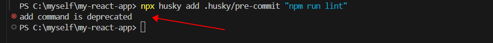
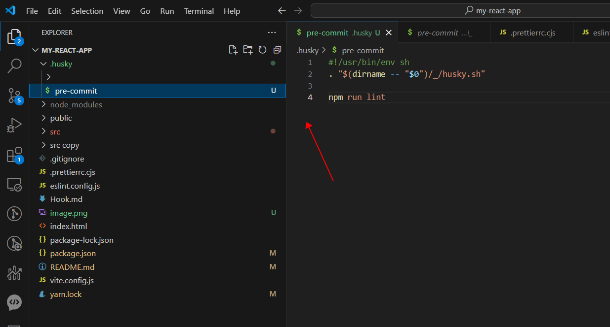
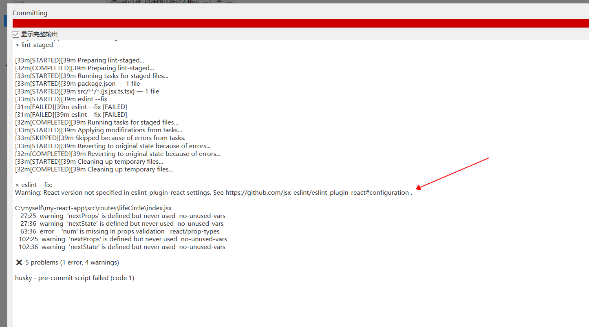
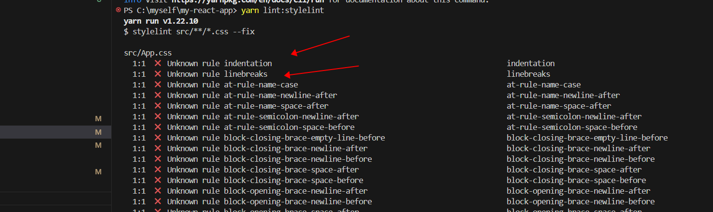

# vite react app

# react R18 执行两次

React 18会再Strict Mode中引入一个新的开发模式。React将会对每一个组件自动取消加载并重新加载。如果其干扰了你的应用，移除Strict Mode就能够修复组件重新加载的问题

# 项目搭建

## 规范

### eslint

```
npm init @eslint/config@latest

```

- vscode 保存自动修复 （在vscoe settings 中配置如下）

```json
"editor.codeActionsOnSave": {

    "source.fixAll.eslint": true
}
```

### prettier

```
yarn add prettier -D

yarn add eslint-config-prettier eslint-plugin-prettier -D
```

### Husky

```
yarn add husky -D

npm pkg set scripts.prepare="husky install"

npm run prepare

```

执行下边这个命令

```
npx husky add .husky/pre-commit "npm run lint"

```

报下边这个


所以手动在.husky目录下添加了 pre-commit文件


- lint-staged

```
yarn add lint-staged -D

```

### commitlint

```
yarn add @commitlint/cli @commitlint/config-conventional -D

```

创建 .commitlintrc.cjs

.husky目录 添加 commit-msg 文件

### stylelint

```
yarn add stylelint stylelint-config-html stylelint-config-recommended-scss stylelint-config-standard stylelint-config-standard-scss stylelint-config-recess-order postcss postcss-html stylelint-config-prettier -D

yarn add -D postcss-less

yarn add -D stylelint-order
```

- 对less的支持
  > Vite本身提供了对.scss/.sass/.less/.styl/.stylus文件的内置支持。无需再安装特定的Vite插件，但必须安装相应的预处理器依赖。

```
yarn add -D less

```

# 问题

## eslint 安装的新版本(9.x) 配置较之前版本变化很大

eslint 安装的新版本(9.x) 配置较之前版本变化很大，需对照文档配置，避免错误

- 之前extends 配置项 现在配置 prettier 的recommended 报错，带解决

## 配置 husky lint-staged 后测试提交



- 解决
  在eslint.config.js添加下边配置

```json
settings: {
    "react": {
    "version": "detect" // 或者明确指定版本号，例如 "17.0"
    }
}
```

## stylelint 配置文件添加了参考文档的一些规则，一直报错



查看了知乎 https://zhuanlan.zhihu.com/p/700412551 这个文档，感觉是因为stylelint版本太高，所以以前的规则都失效了

# 参考链接

[react router官方文档地址](https://reactrouter.com/en/main)

[项目搭建参考](https://juejin.cn/post/7123612981895626760?searchId=20240614140609B26FCD8ABC89B882D749#heading-4)

[eslint vscode保存自动格式化参考](https://juejin.cn/post/6987198844261892127)

[Git工作流规范（husky + lint-staged](http://yanhongzhi.com/post/project_specification4.html#toc-f4b)

[commitlint 规范参考文档](https://github.com/conventional-changelog/commitlint#what-is-commitlint)

[style lint参考1 知乎](https://zhuanlan.zhihu.com/p/700412551)
[style lint参考2 掘金](https://juejin.cn/post/7185920750765735973?searchId=202406171654115E104E724B2EE73D9DA9#heading-28)
[styleLint中午官方文档](https://stylelint.nodejs.cn/)
[对less的支持](https://juejin.cn/post/7240838046789812282?searchId=202406171725573BDAF8C0F24C53401A70#heading-7)
